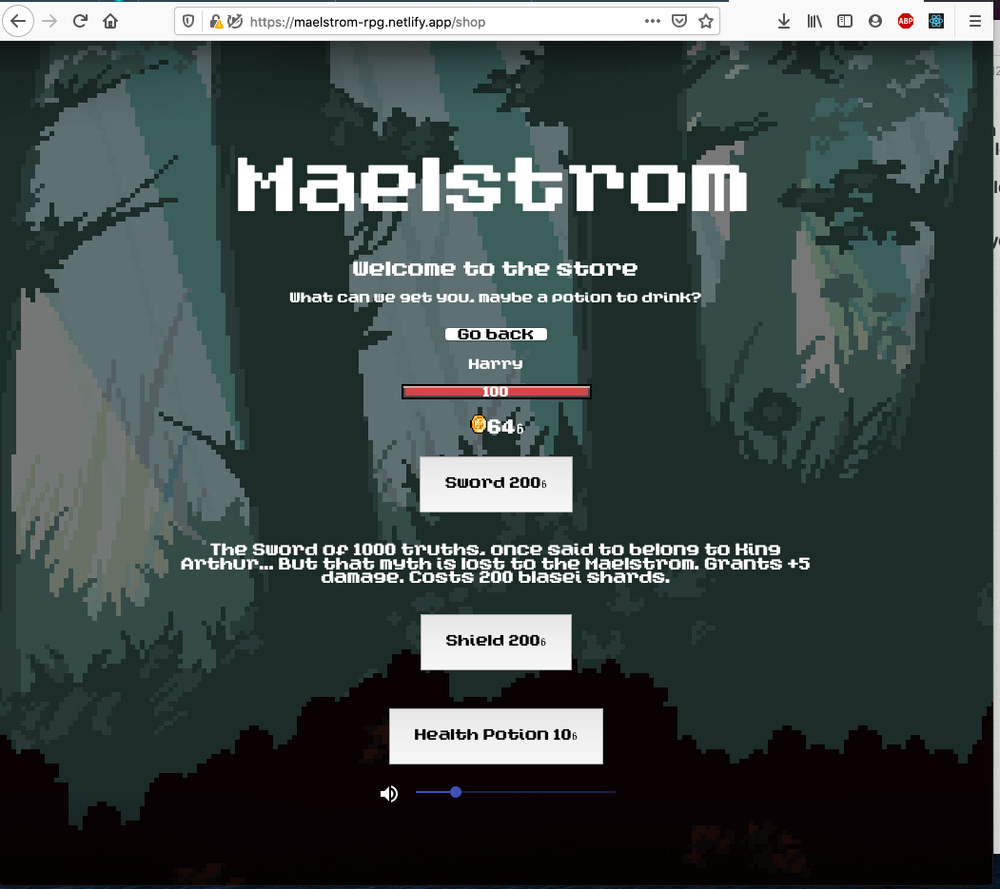

# Welcome to Maelstrom

Maelstrom is a fantasy turned based role playing game!
A world bending whirlpool has merged the sci-fi and fantasy worlds into one, you must battle against all divisions of monsters to get gold and survive!

Hosted on Netflify, play [here](https://maelstrom-rpg.netlify.app/)!

## The dev team
- [Ryan Viegas](https://github.com/rjkviegas)
- [Harry Lingard-Bright](https://github.com/harrylb14/)
- [Ilja Gonciarov](https://github.com/Gonciarov)
- [Daniel Moris](https://github.com/dwram)
- [Dillon Barker](https://github.com/DillonBarker)

## Screenshots

#### Welcome to the Maelstrom

#### Fight hoards of enemies from the sci-fi and fantasy worlds! 

#### Shop for upgrades and health potions

#### Experience true role playing and level up your character

## To run and test locally

1. clone this repo
2. `npm install`, this will install the dependencies needed.
3. `npm start`, Runs the app in the development mode. Open [http://localhost:3000](http://localhost:3000) to view it in the browser.
4. `npm test`, will run the tests

## Our tech stack
- **Languages:** JavaScript, HTML5 and CSS
- **Front end:** React
- **CI/CD:** Travis-CI   
- **Hosting:** Netlify
- **Testing:** Jest
